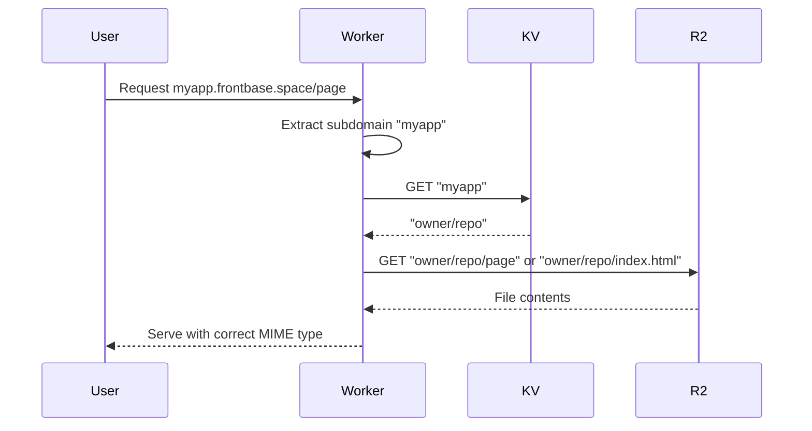
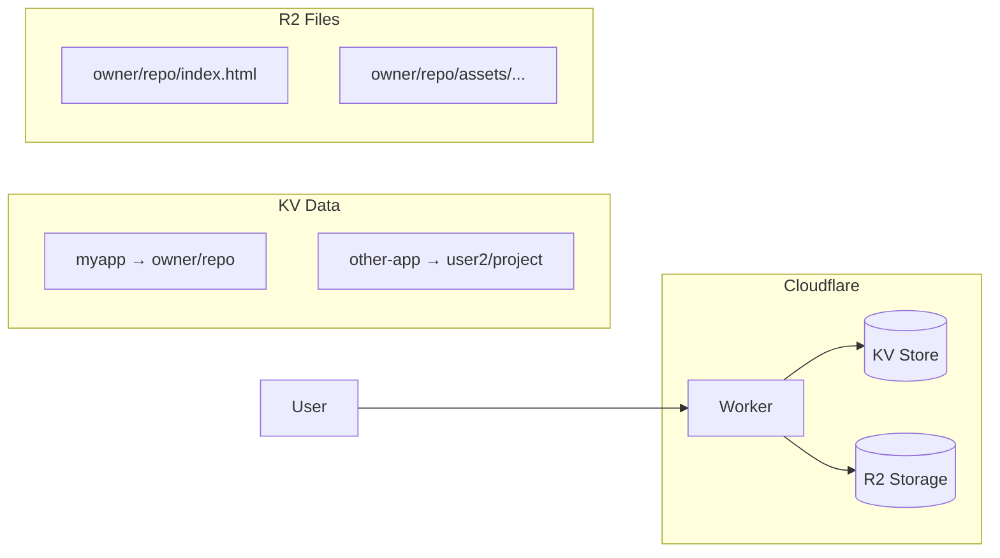

# Frontbase Cloudflare Worker

**Frontbase** is a platform for deploying static frontend projects to the edge. This Cloudflare Worker serves deployed sites from R2 storage based on subdomain routing via KV.

**This repo** contains the edge worker that routes `*.frontbase.space` requests to the correct R2 files.

- Frontend repo: [Frontbase-Frontend](https://github.com/Vijay-papanaboina/Frontbase-Frontend.git)
- Backend repo: [Frontbase-Backend](https://github.com/Vijay-papanaboina/Frontbase-Backend.git)

## How It Works



### Request Flow

1. **Extract subdomain** from request host (`myapp.frontbase.space` → `myapp`)
2. **Lookup folder prefix** in KV using the subdomain as key
3. **Build R2 key** as `${folderPrefix}/${pathname}`
4. **Fetch from R2** and serve with correct content type
5. **SPA fallback** - if file not found and not an asset, serve `index.html`

## Architecture



## Directory Structure

```
r2-worker/
  src/
    worker.js       # Main worker code
  wrangler.toml     # Cloudflare configuration
```

## Wrangler Bindings

Defined in `wrangler.toml`:

| Binding                | Type         | Name                |
| ---------------------- | ------------ | ------------------- |
| `R2Binding`            | R2 Bucket    | `frontbase`         |
| `Frontbase_KV_Binding` | KV Namespace | (your namespace ID) |

## Local Development

```bash
# Install Wrangler globally
npm i -g wrangler

# Authenticate with Cloudflare
wrangler login

# Start local dev server
wrangler dev
```

## Deployment

```bash
# Deploy to Cloudflare
wrangler deploy
```

### DNS Configuration

Point your domain to the Worker:

- `*.frontbase.space` → Worker route

### KV Population

The backend automatically populates KV when deploying:

- **Key**: subdomain (e.g., `myapp`)
- **Value**: R2 folder prefix (e.g., `owner/repo`)

## Troubleshooting

| Issue             | Solution                                |
| ----------------- | --------------------------------------- |
| 404 Not Found     | Check KV has the subdomain key          |
| Wrong MIME type   | Verify file extension is correct        |
| SPA routes 404    | Non-asset paths fall back to index.html |
| Permission denied | Verify R2/KV bindings in wrangler.toml  |

## Cross-Links

- **Backend**: https://github.com/Vijay-papanaboina/Frontbase-Backend.git
- **Frontend**: https://github.com/Vijay-papanaboina/Frontbase-Frontend.git

## License

MIT
